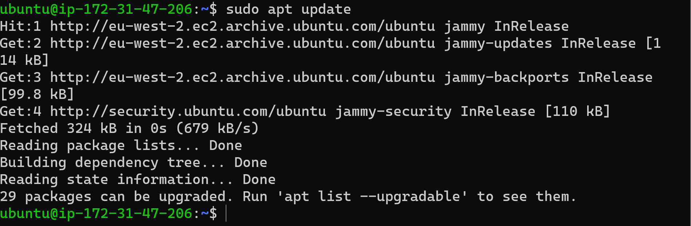
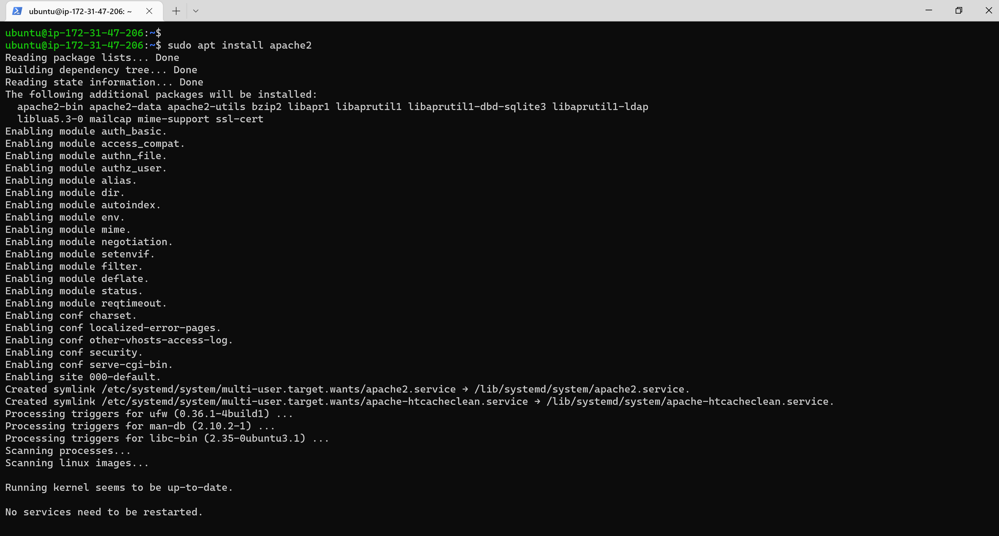
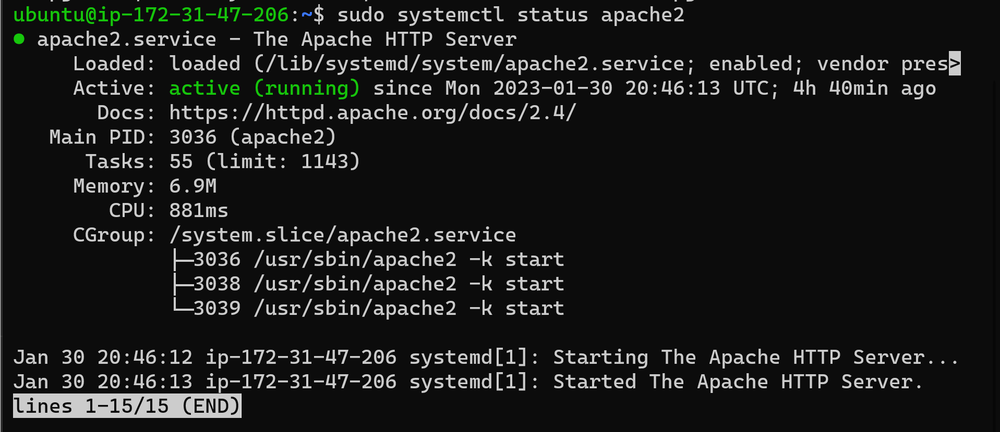
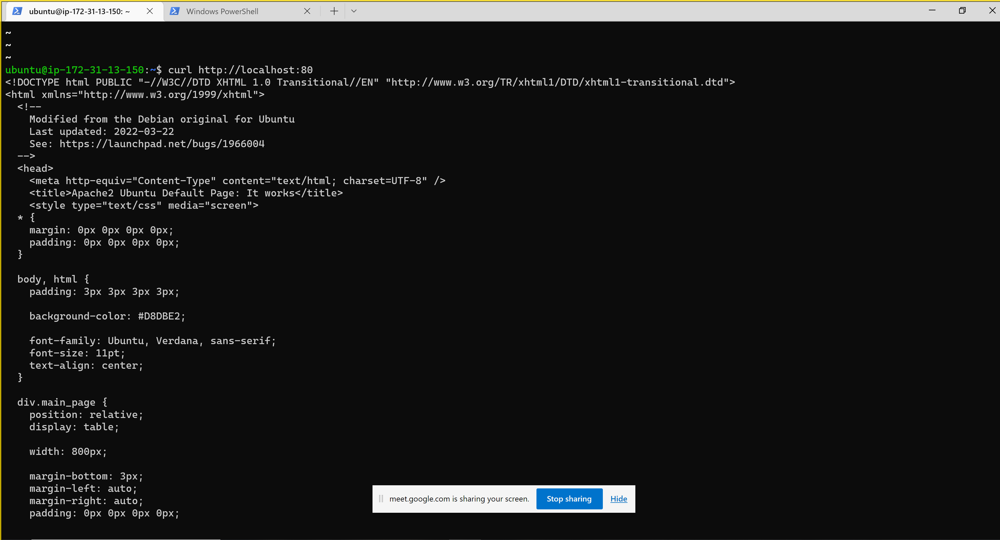
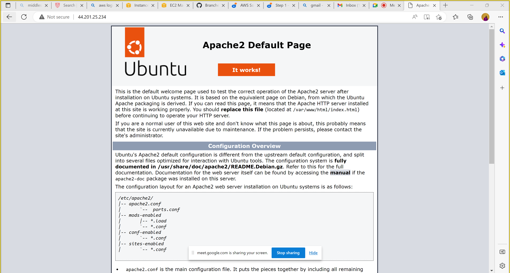
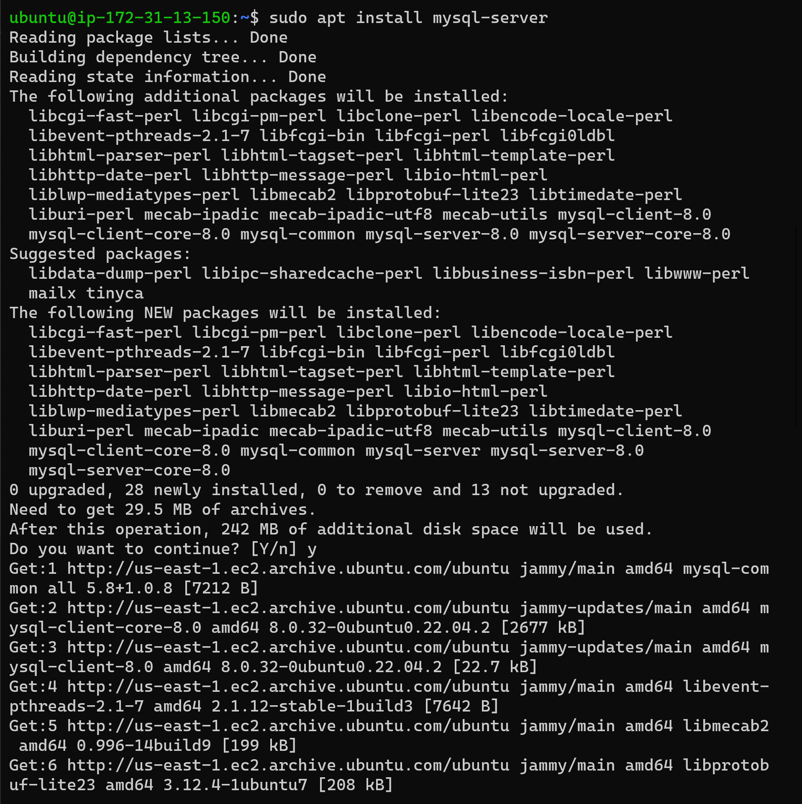
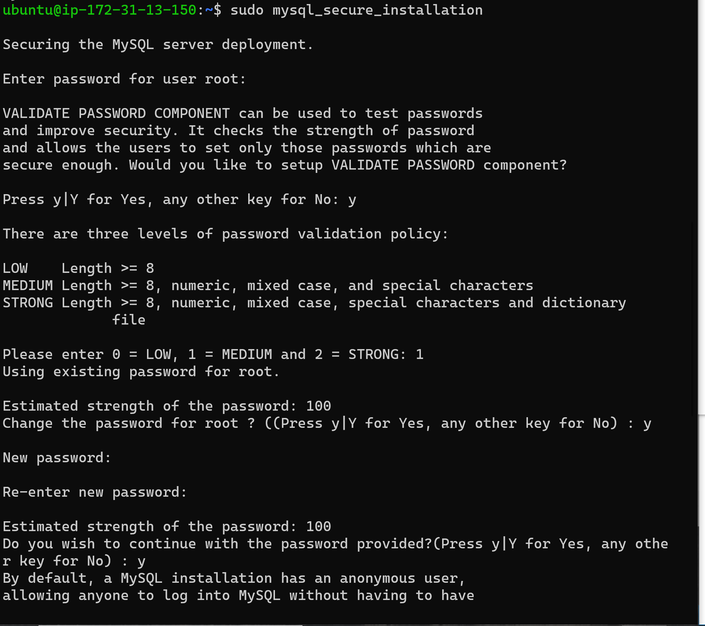

# Project 1
## Installing apache and updating the firewall

`sudo apt update` to update all the list of packages 

`sudo apt instal apache2` to install the apache package 

`sudo systemctl status apache2 ` to confrim if the apache is running as a service in our operating system 

`local host and public adress` To access the server locally and also test how our Apache HTTP server can respond to requests from the Internet 

On web 

## Installing mysql

`sudo apt install mysql-serve` to acquire and install mysql server  

`sudo mysql` to login into MYSQL console 

`ALTER USER 'root'@'localhost' IDENTIFIED WITH mysql_native_password BY 'PassWord.1';` setting default password 

`sudo mysql_secure_installation` Changing the default password 
